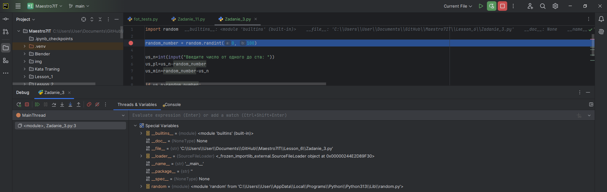

## Создание игры "Симулятор студента" на языке программирования С++

Деньги: 100 рублей
Сытость: 100%
Сон: 100%
Настроение: 100%
Успеваемость: 100%

**Преподаватель:** Дуплей Максим Игоревич

**Автор:** Данилов Георгий Алексеевич

**Дата:** 29.01.2025
